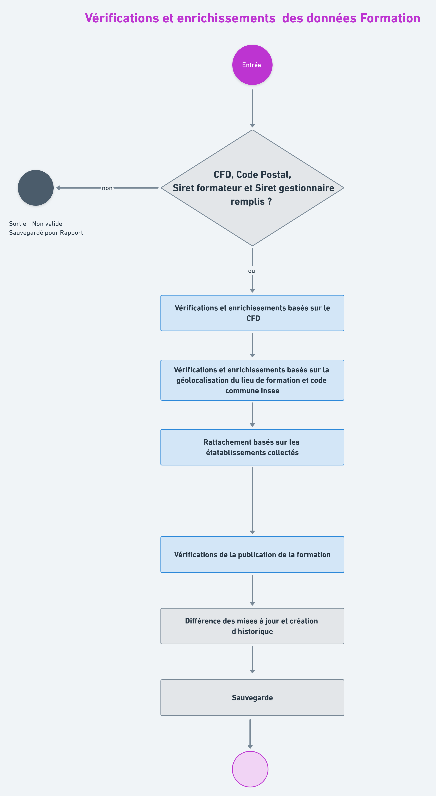
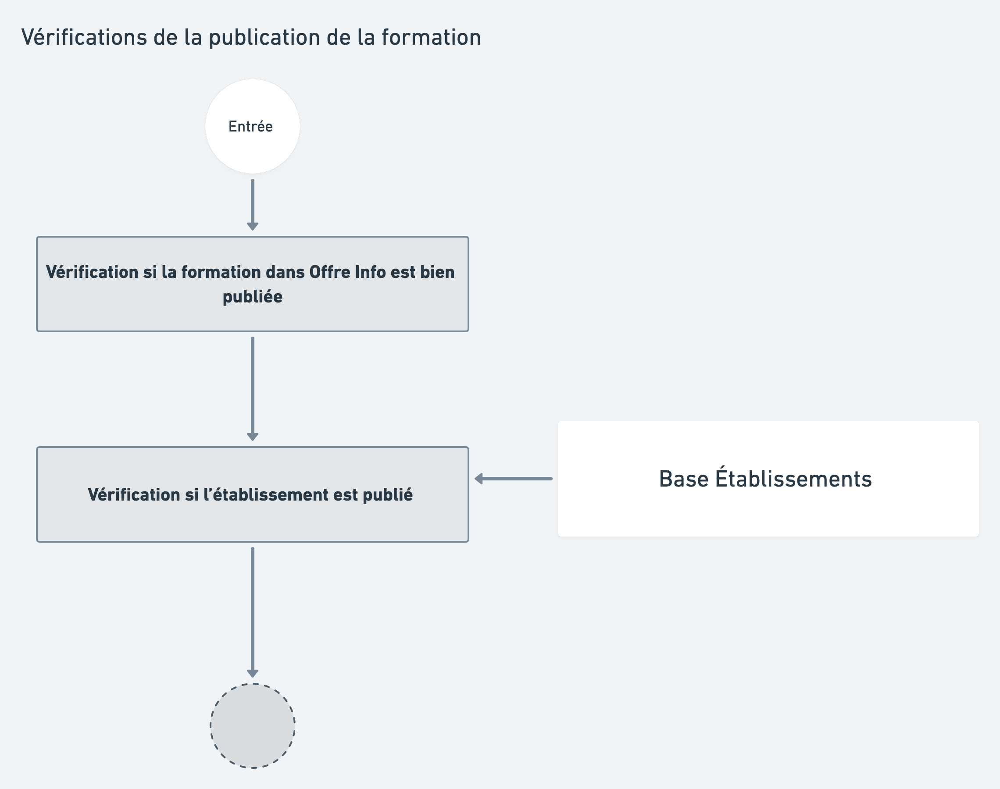
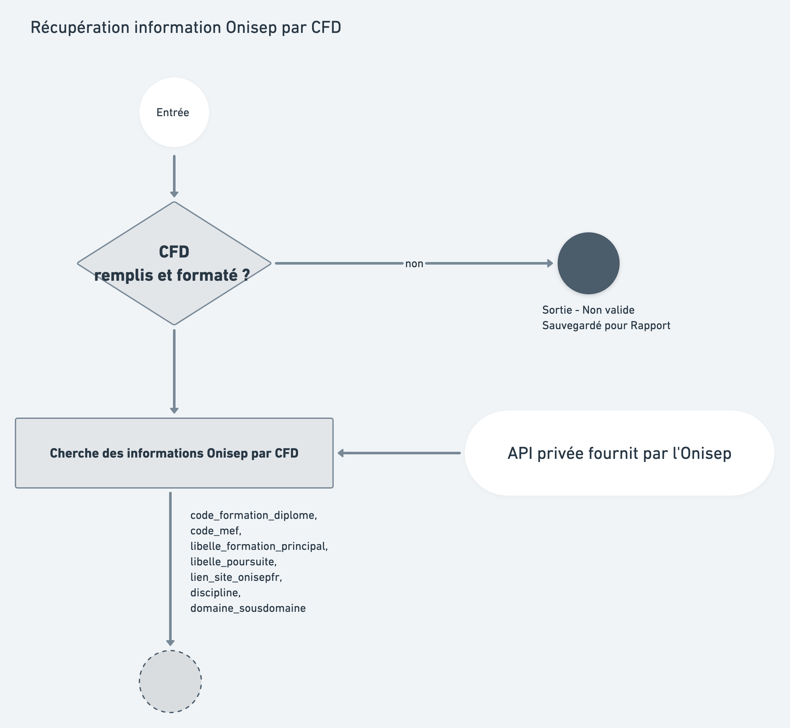

# Traitements liés aux formations

## I. Vue d’ensemble

.png>)

## II.  Détails des traitements



### II.1 Vérifications et enrichissements via le code formation diplôme (CFD)

_Vérification des données Diplôme Niveau Intitulé_


* Vérifier que le code formation diplôme existe dans l'une des tables BCN (Base Centrale des Nomenclatures) [N\_FORMATION\_DIPLOME](http://infocentre.pleiade.education.fr/bcn/workspace/viewTable/n/N\_FORMATION\_DIPLOME) ou [V\_FORMATION\_DIPLOME](http://infocentre.pleiade.education.fr/bcn/workspace/viewTable/n/V\_FORMATION\_DIPLOME)
* Vérifier que le code formation diplôme est valide :&#x20;
  * Recherche de code formation diplôme plus récent et remplacer le cas échéant.
  * Encore actif sur la période affichage offre de formation - _**31 Août de l’année courante.**_
* S'assurer que le niveau de formation est bien celui délivré par le diplôme/titre visé
* S'assurer que la nomenclature européenne des niveaux est affichée
* Récupérer les intitulés court et long normalisés du diplôme selon les nomenclatures utilisées par l'Éducation nationale et l'Enseignement supérieur
* Recherche et récupération des codes MEFs 10 associés dans la table BCN [N\_MEF](https://infocentre.pleiade.education.fr/bcn/workspace/viewTable/n/N\_MEF)
* Ajout des informations Onisep lié à ce code diplôme. [Détails Onisep plus bas dans cette page.](https://mission-apprentissage.gitbook.io/catalogue/traitements-scripts/traitements-lies-aux-formations#iii-4-onisep-descriptif-formation)&#x20;
* Ajout des informations RNCP lié à ce code diplôme.  [Détails RNCP plus bas dans cette page](https://mission-apprentissage.gitbook.io/catalogue/traitements-scripts/traitements-lies-aux-formations#iii-1-verifications-rncp-pour-une-formation).

### II.2 Vérifications et enrichissements via la géolocalisation et le code commune Insee

.png>)

_Vérification cohérence et rattachement académique_

Les informations de géolocalisation (longitude / latitude) sont collectées par les Carif-Oref. Les traitements suivants sont appliqués :

* Récupération des données adresse (normalisation du numéro voie, type de voie, nom de voie, code postal, localité) en utilisant l'API de géocodage inverse de la BAN ([https://api-adresse.data.gouv.fr/reverse/](https://api-adresse.data.gouv.fr/reverse/))
* Enrichissement avec nom de commune, numéro de département, nom de département, nom région, numéro de région, num académie, nom académie. Les informations sur l'académie sont récupérées via une liste statique (fichier plat json).

```javascript
{
  "10": {
    "nom_dept": "Aube",
    "code_dept": "10",
    "nom_region": "Grand Est",
    "code_region": "44",
    "nom_academie": "Reims",
    "num_academie": 19
  },
  "11": {
    "nom_dept": "Aude",
    "code_dept": "11",
    "nom_region": "Occitanie",
    "code_region": "76",
    "nom_academie": "Montpellier",
    "num_academie": 11
  },
  "12": {
    "nom_dept": "Aveyron",
    "code_dept": "12",
    "nom_region": "Occitanie",
    "code_region": "76",
    "nom_academie": "Toulouse",
    "num_academie": 16
  },
  "13": {
    "nom_dept": "Bouches-du-Rhône",
    "code_dept": "13",
    "nom_region": "Provence-Alpes-Côte d'Azur",
    "code_region": "93",
    "nom_academie": "Aix-Marseille",
    "num_academie": 2
  },
  "14": {
    "nom_dept": "Calvados",
    "code_dept": "14",
    "nom_region": "Normandie",
    "code_region": "28",
    "nom_academie": "Normandie",
    "num_academie": 70
  },
  "15": {
    "nom_dept": "Cantal",
    "code_dept": "15",
    "nom_region": "Auvergne-Rhône-Alpes",
    "code_region": "84",
    "nom_academie": "Clermont-Ferrand",
    "num_academie": 6
  },
  "16": {
    "nom_dept": "Charente",
    "code_dept": "16",
    "nom_region": "Nouvelle-Aquitaine",
    "code_region": "75",
    "nom_academie": "Poitiers",
    "num_academie": 13
  },
  "17": {
    "nom_dept": "Charente-Maritime",
    "code_dept": "17",
    "nom_region": "Nouvelle-Aquitaine",
    "code_region": "75",
    "nom_academie": "Poitiers",
    "num_academie": 13
  },
  "18": {
    "nom_dept": "Cher",
    "code_dept": "18",
    "nom_region": "Centre-Val de Loire",
    "code_region": "24",
    "nom_academie": "Orléans-Tours",
    "num_academie": 18
  },
  "19": {
    "nom_dept": "Corrèze",
    "code_dept": "19",
    "nom_region": "Nouvelle-Aquitaine",
    "code_region": "75",
    "nom_academie": "Limoges",
    "num_academie": 22
  },
  "21": {
    "nom_dept": "Côte-d'Or",
    "code_dept": "21",
    "nom_region": "Bourgogne-Franche-Comté",
    "code_region": "27",
    "nom_academie": "Dijon",
    "num_academie": 7
  },
  "22": {
    "nom_dept": "Côtes-d'Armor",
    "code_dept": "22",
    "nom_region": "Bretagne",
    "code_region": "53",
    "nom_academie": "Rennes",
    "num_academie": 14
  },
  "23": {
    "nom_dept": "Creuse",
    "code_dept": "23",
    "nom_region": "Nouvelle-Aquitaine",
    "code_region": "75",
    "nom_academie": "Limoges",
    "num_academie": 22
  },
  "24": {
    "nom_dept": "Dordogne",
    "code_dept": "24",
    "nom_region": "Nouvelle-Aquitaine",
    "code_region": "75",
    "nom_academie": "Bordeaux",
    "num_academie": 4
  },
  "25": {
    "nom_dept": "Doubs",
    "code_dept": "25",
    "nom_region": "Bourgogne-Franche-Comté",
    "code_region": "27",
    "nom_academie": "Besançon",
    "num_academie": 3
  },
  "26": {
    "nom_dept": "Drôme",
    "code_dept": "26",
    "nom_region": "Auvergne-Rhône-Alpes",
    "code_region": "84",
    "nom_academie": "Grenoble",
    "num_academie": 8
  },
  "27": {
    "nom_dept": "Eure",
    "code_dept": "27",
    "nom_region": "Normandie",
    "code_region": "28",
    "nom_academie": "Normandie",
    "num_academie": 70
  },
  "28": {
    "nom_dept": "Eure-et-Loir",
    "code_dept": "28",
    "nom_region": "Centre-Val de Loire",
    "code_region": "24",
    "nom_academie": "Orléans-Tours",
    "num_academie": 18
  },
  "29": {
    "nom_dept": "Finistère",
    "code_dept": "29",
    "nom_region": "Bretagne",
    "code_region": "53",
    "nom_academie": "Rennes",
    "num_academie": 14
  },
  "30": {
    "nom_dept": "Gard",
    "code_dept": "30",
    "nom_region": "Occitanie",
    "code_region": "76",
    "nom_academie": "Montpellier",
    "num_academie": 11
  },
  "31": {
    "nom_dept": "Haute-Garonne",
    "code_dept": "31",
    "nom_region": "Occitanie",
    "code_region": "76",
    "nom_academie": "Toulouse",
    "num_academie": 16
  },
  "32": {
    "nom_dept": "Gers",
    "code_dept": "32",
    "nom_region": "Occitanie",
    "code_region": "76",
    "nom_academie": "Toulouse",
    "num_academie": 16
  },
  "33": {
    "nom_dept": "Gironde",
    "code_dept": "33",
    "nom_region": "Nouvelle-Aquitaine",
    "code_region": "75",
    "nom_academie": "Bordeaux",
    "num_academie": 4
  },
  "34": {
    "nom_dept": "Hérault",
    "code_dept": "34",
    "nom_region": "Occitanie",
    "code_region": "76",
    "nom_academie": "Montpellier",
    "num_academie": 11
  },
  "35": {
    "nom_dept": "Ille-et-Vilaine",
    "code_dept": "35",
    "nom_region": "Bretagne",
    "code_region": "53",
    "nom_academie": "Rennes",
    "num_academie": 14
  },
  "36": {
    "nom_dept": "Indre",
    "code_dept": "36",
    "nom_region": "Centre-Val de Loire",
    "code_region": "24",
    "nom_academie": "Orléans-Tours",
    "num_academie": 18
  },
  "37": {
    "nom_dept": "Indre-et-Loire",
    "code_dept": "37",
    "nom_region": "Centre-Val de Loire",
    "code_region": "24",
    "nom_academie": "Orléans-Tours",
    "num_academie": 18
  },
  "38": {
    "nom_dept": "Isère",
    "code_dept": "38",
    "nom_region": "Auvergne-Rhône-Alpes",
    "code_region": "84",
    "nom_academie": "Grenoble",
    "num_academie": 8
  },
  "39": {
    "nom_dept": "Jura",
    "code_dept": "39",
    "nom_region": "Bourgogne-Franche-Comté",
    "code_region": "27",
    "nom_academie": "Besançon",
    "num_academie": 3
  },
  "40": {
    "nom_dept": "Landes",
    "code_dept": "40",
    "nom_region": "Nouvelle-Aquitaine",
    "code_region": "75",
    "nom_academie": "Bordeaux",
    "num_academie": 4
  },
  "41": {
    "nom_dept": "Loir-et-Cher",
    "code_dept": "41",
    "nom_region": "Centre-Val de Loire",
    "code_region": "24",
    "nom_academie": "Orléans-Tours",
    "num_academie": 18
  },
  "42": {
    "nom_dept": "Loire",
    "code_dept": "42",
    "nom_region": "Auvergne-Rhône-Alpes",
    "code_region": "84",
    "nom_academie": "Lyon",
    "num_academie": 10
  },
  "43": {
    "nom_dept": "Haute-Loire",
    "code_dept": "43",
    "nom_region": "Auvergne-Rhône-Alpes",
    "code_region": "84",
    "nom_academie": "Clermont-Ferrand",
    "num_academie": 6
  },
  "44": {
    "nom_dept": "Loire-Atlantique",
    "code_dept": "44",
    "nom_region": "Pays de la Loire",
    "code_region": "52",
    "nom_academie": "Nantes",
    "num_academie": 17
  },
  "45": {
    "nom_dept": "Loiret",
    "code_dept": "45",
    "nom_region": "Centre-Val de Loire",
    "code_region": "24",
    "nom_academie": "Orléans-Tours",
    "num_academie": 18
  },
  "46": {
    "nom_dept": "Lot",
    "code_dept": "46",
    "nom_region": "Occitanie",
    "code_region": "76",
    "nom_academie": "Toulouse",
    "num_academie": 16
  },
  "47": {
    "nom_dept": "Lot-et-Garonne",
    "code_dept": "47",
    "nom_region": "Nouvelle-Aquitaine",
    "code_region": "75",
    "nom_academie": "Bordeaux",
    "num_academie": 4
  },
  "48": {
    "nom_dept": "Lozère",
    "code_dept": "48",
    "nom_region": "Occitanie",
    "code_region": "76",
    "nom_academie": "Montpellier",
    "num_academie": 11
  },
  "49": {
    "nom_dept": "Maine-et-Loire",
    "code_dept": "49",
    "nom_region": "Pays de la Loire",
    "code_region": "52",
    "nom_academie": "Nantes",
    "num_academie": 17
  },
  "50": {
    "nom_dept": "Manche",
    "code_dept": "50",
    "nom_region": "Normandie",
    "code_region": "28",
    "nom_academie": "Normandie",
    "num_academie": 70
  },
  "51": {
    "nom_dept": "Marne",
    "code_dept": "51",
    "nom_region": "Grand Est",
    "code_region": "44",
    "nom_academie": "Reims",
    "num_academie": 19
  },
  "52": {
    "nom_dept": "Haute-Marne",
    "code_dept": "52",
    "nom_region": "Grand Est",
    "code_region": "44",
    "nom_academie": "Reims",
    "num_academie": 19
  },
  "53": {
    "nom_dept": "Mayenne",
    "code_dept": "53",
    "nom_region": "Pays de la Loire",
    "code_region": "52",
    "nom_academie": "Nantes",
    "num_academie": 17
  },
  "54": {
    "nom_dept": "Meurthe-et-Moselle",
    "code_dept": "54",
    "nom_region": "Grand Est",
    "code_region": "44",
    "nom_academie": "Nancy-Metz",
    "num_academie": 12
  },
  "55": {
    "nom_dept": "Meuse",
    "code_dept": "55",
    "nom_region": "Grand Est",
    "code_region": "44",
    "nom_academie": "Nancy-Metz",
    "num_academie": 12
  },
  "56": {
    "nom_dept": "Morbihan",
    "code_dept": "56",
    "nom_region": "Bretagne",
    "code_region": "53",
    "nom_academie": "Rennes",
    "num_academie": 14
  },
  "57": {
    "nom_dept": "Moselle",
    "code_dept": "57",
    "nom_region": "Grand Est",
    "code_region": "44",
    "nom_academie": "Nancy-Metz",
    "num_academie": 12
  },
  "58": {
    "nom_dept": "Nièvre",
    "code_dept": "58",
    "nom_region": "Bourgogne-Franche-Comté",
    "code_region": "27",
    "nom_academie": "Dijon",
    "num_academie": 7
  },
  "59": {
    "nom_dept": "Nord",
    "code_dept": "59",
    "nom_region": "Hauts-de-France",
    "code_region": "32",
    "nom_academie": "Lille",
    "num_academie": 9
  },
  "60": {
    "nom_dept": "Oise",
    "code_dept": "60",
    "nom_region": "Hauts-de-France",
    "code_region": "32",
    "nom_academie": "Amiens",
    "num_academie": 20
  },
  "61": {
    "nom_dept": "Orne",
    "code_dept": "61",
    "nom_region": "Normandie",
    "code_region": "28",
    "nom_academie": "Normandie",
    "num_academie": 70
  },
  "62": {
    "nom_dept": "Pas-de-Calais",
    "code_dept": "62",
    "nom_region": "Hauts-de-France",
    "code_region": "32",
    "nom_academie": "Lille",
    "num_academie": 9
  },
  "63": {
    "nom_dept": "Puy-de-Dôme",
    "code_dept": "63",
    "nom_region": "Auvergne-Rhône-Alpes",
    "code_region": "84",
    "nom_academie": "Clermont-Ferrand",
    "num_academie": 6
  },
  "64": {
    "nom_dept": "Pyrénées-Atlantiques",
    "code_dept": "64",
    "nom_region": "Nouvelle-Aquitaine",
    "code_region": "75",
    "nom_academie": "Bordeaux",
    "num_academie": 4
  },
  "65": {
    "nom_dept": "Hautes-Pyrénées",
    "code_dept": "65",
    "nom_region": "Occitanie",
    "code_region": "76",
    "nom_academie": "Toulouse",
    "num_academie": 16
  },
  "66": {
    "nom_dept": "Pyrénées-Orientales",
    "code_dept": "66",
    "nom_region": "Occitanie",
    "code_region": "76",
    "nom_academie": "Montpellier",
    "num_academie": 11
  },
  "67": {
    "nom_dept": "Bas-Rhin",
    "code_dept": "67",
    "nom_region": "Grand Est",
    "code_region": "44",
    "nom_academie": "Strasbourg",
    "num_academie": 15
  },
  "68": {
    "nom_dept": "Haut-Rhin",
    "code_dept": "68",
    "nom_region": "Grand Est",
    "code_region": "44",
    "nom_academie": "Strasbourg",
    "num_academie": 15
  },
  "69": {
    "nom_dept": "Rhône",
    "code_dept": "69",
    "nom_region": "Auvergne-Rhône-Alpes",
    "code_region": "84",
    "nom_academie": "Lyon",
    "num_academie": 10
  },
  "70": {
    "nom_dept": "Haute-Saône",
    "code_dept": "70",
    "nom_region": "Bourgogne-Franche-Comté",
    "code_region": "27",
    "nom_academie": "Besançon",
    "num_academie": 3
  },
  "71": {
    "nom_dept": "Saône-et-Loire",
    "code_dept": "71",
    "nom_region": "Bourgogne-Franche-Comté",
    "code_region": "27",
    "nom_academie": "Dijon",
    "num_academie": 7
  },
  "72": {
    "nom_dept": "Sarthe",
    "code_dept": "72",
    "nom_region": "Pays de la Loire",
    "code_region": "52",
    "nom_academie": "Nantes",
    "num_academie": 17
  },
  "73": {
    "nom_dept": "Savoie",
    "code_dept": "73",
    "nom_region": "Auvergne-Rhône-Alpes",
    "code_region": "84",
    "nom_academie": "Grenoble",
    "num_academie": 8
  },
  "74": {
    "nom_dept": "Haute-Savoie",
    "code_dept": "74",
    "nom_region": "Auvergne-Rhône-Alpes",
    "code_region": "84",
    "nom_academie": "Grenoble",
    "num_academie": 8
  },
  "75": {
    "nom_dept": "Paris",
    "code_dept": "75",
    "nom_region": "Île-de-France",
    "code_region": "11",
    "nom_academie": "Paris",
    "num_academie": 1
  },
  "76": {
    "nom_dept": "Seine-Maritime",
    "code_dept": "76",
    "nom_region": "Normandie",
    "code_region": "28",
    "nom_academie": "Normandie",
    "num_academie": 70
  },
  "77": {
    "nom_dept": "Seine-et-Marne",
    "code_dept": "77",
    "nom_region": "Île-de-France",
    "code_region": "11",
    "nom_academie": "Créteil",
    "num_academie": 24
  },
  "78": {
    "nom_dept": "Yvelines",
    "code_dept": "78",
    "nom_region": "Île-de-France",
    "code_region": "11",
    "nom_academie": "Versailles",
    "num_academie": 25
  },
  "79": {
    "nom_dept": "Deux-Sèvres",
    "code_dept": "79",
    "nom_region": "Nouvelle-Aquitaine",
    "code_region": "75",
    "nom_academie": "Poitiers",
    "num_academie": 13
  },
  "80": {
    "nom_dept": "Somme",
    "code_dept": "80",
    "nom_region": "Hauts-de-France",
    "code_region": "32",
    "nom_academie": "Amiens",
    "num_academie": 20
  },
  "81": {
    "nom_dept": "Tarn",
    "code_dept": "81",
    "nom_region": "Occitanie",
    "code_region": "76",
    "nom_academie": "Toulouse",
    "num_academie": 16
  },
  "82": {
    "nom_dept": "Tarn-et-Garonne",
    "code_dept": "82",
    "nom_region": "Occitanie",
    "code_region": "76",
    "nom_academie": "Toulouse",
    "num_academie": 16
  },
  "83": {
    "nom_dept": "Var",
    "code_dept": "83",
    "nom_region": "Provence-Alpes-Côte d'Azur",
    "code_region": "93",
    "nom_academie": "Nice",
    "num_academie": 23
  },
  "84": {
    "nom_dept": "Vaucluse",
    "code_dept": "84",
    "nom_region": "Provence-Alpes-Côte d'Azur",
    "code_region": "93",
    "nom_academie": "Aix-Marseille",
    "num_academie": 2
  },
  "85": {
    "nom_dept": "Vendée",
    "code_dept": "85",
    "nom_region": "Pays de la Loire",
    "code_region": "52",
    "nom_academie": "Nantes",
    "num_academie": 17
  },
  "86": {
    "nom_dept": "Vienne",
    "code_dept": "86",
    "nom_region": "Nouvelle-Aquitaine",
    "code_region": "75",
    "nom_academie": "Poitiers",
    "num_academie": 13
  },
  "87": {
    "nom_dept": "Haute-Vienne",
    "code_dept": "87",
    "nom_region": "Nouvelle-Aquitaine",
    "code_region": "75",
    "nom_academie": "Limoges",
    "num_academie": 22
  },
  "88": {
    "nom_dept": "Vosges",
    "code_dept": "88",
    "nom_region": "Grand Est",
    "code_region": "44",
    "nom_academie": "Nancy-Metz",
    "num_academie": 12
  },
  "89": {
    "nom_dept": "Yonne",
    "code_dept": "89",
    "nom_region": "Bourgogne-Franche-Comté",
    "code_region": "27",
    "nom_academie": "Dijon",
    "num_academie": 7
  },
  "90": {
    "nom_dept": "Territoire de Belfort",
    "code_dept": "90",
    "nom_region": "Bourgogne-Franche-Comté",
    "code_region": "27",
    "nom_academie": "Besançon",
    "num_academie": 3
  },
  "91": {
    "nom_dept": "Essonne",
    "code_dept": "91",
    "nom_region": "Île-de-France",
    "code_region": "11",
    "nom_academie": "Versailles",
    "num_academie": 25
  },
  "92": {
    "nom_dept": "Hauts-de-Seine",
    "code_dept": "92",
    "nom_region": "Île-de-France",
    "code_region": "11",
    "nom_academie": "Versailles",
    "num_academie": 25
  },
  "93": {
    "nom_dept": "Seine-Saint-Denis",
    "code_dept": "93",
    "nom_region": "Île-de-France",
    "code_region": "11",
    "nom_academie": "Créteil",
    "num_academie": 24
  },
  "94": {
    "nom_dept": "Val-de-Marne",
    "code_dept": "94",
    "nom_region": "Île-de-France",
    "code_region": "11",
    "nom_academie": "Créteil",
    "num_academie": 24
  },
  "95": {
    "nom_dept": "Val-d'Oise",
    "code_dept": "95",
    "nom_region": "Île-de-France",
    "code_region": "11",
    "nom_academie": "Versailles",
    "num_academie": 25
  },
  "971": {
    "nom_dept": "Guadeloupe",
    "code_dept": "971",
    "nom_region": "Guadeloupe",
    "code_region": "01",
    "nom_academie": "Guadeloupe",
    "num_academie": 32
  },
  "972": {
    "nom_dept": "Martinique",
    "code_dept": "972",
    "nom_region": "Martinique",
    "code_region": "02",
    "nom_academie": "Martinique",
    "num_academie": 31
  },
  "973": {
    "nom_dept": "Guyane",
    "code_dept": "973",
    "nom_region": "Guyane",
    "code_region": "03",
    "nom_academie": "Guyane",
    "num_academie": 33
  },
  "974": {
    "nom_dept": "La Réunion",
    "code_dept": "974",
    "nom_region": "La Réunion",
    "code_region": "04",
    "nom_academie": "La Réunion",
    "num_academie": 28
  },
  "976": {
    "nom_dept": "Mayotte",
    "code_dept": "976",
    "nom_region": "Mayotte",
    "code_region": "06",
    "nom_academie": "Mayotte",
    "num_academie": 43
  },
  "01": {
    "nom_dept": "Ain",
    "code_dept": "01",
    "nom_region": "Auvergne-Rhône-Alpes",
    "code_region": "84",
    "nom_academie": "Lyon",
    "num_academie": 10
  },
  "02": {
    "nom_dept": "Aisne",
    "code_dept": "02",
    "nom_region": "Hauts-de-France",
    "code_region": "32",
    "nom_academie": "Amiens",
    "num_academie": 20
  },
  "03": {
    "nom_dept": "Allier",
    "code_dept": "03",
    "nom_region": "Auvergne-Rhône-Alpes",
    "code_region": "84",
    "nom_academie": "Clermont-Ferrand",
    "num_academie": 6
  },
  "04": {
    "nom_dept": "Alpes-de-Haute-Provence",
    "code_dept": "04",
    "nom_region": "Provence-Alpes-Côte d'Azur",
    "code_region": "93",
    "nom_academie": "Aix-Marseille",
    "num_academie": 2
  },
  "05": {
    "nom_dept": "Hautes-Alpes",
    "code_dept": "05",
    "nom_region": "Provence-Alpes-Côte d'Azur",
    "code_region": "93",
    "nom_academie": "Aix-Marseille",
    "num_academie": 2
  },
  "06": {
    "nom_dept": "Alpes-Maritimes",
    "code_dept": "06",
    "nom_region": "Provence-Alpes-Côte d'Azur",
    "code_region": "93",
    "nom_academie": "Nice",
    "num_academie": 23
  },
  "07": {
    "nom_dept": "Ardèche",
    "code_dept": "07",
    "nom_region": "Auvergne-Rhône-Alpes",
    "code_region": "84",
    "nom_academie": "Grenoble",
    "num_academie": 8
  },
  "08": {
    "nom_dept": "Ardennes",
    "code_dept": "08",
    "nom_region": "Grand Est",
    "code_region": "44",
    "nom_academie": "Reims",
    "num_academie": 19
  },
  "09": {
    "nom_dept": "Ariège",
    "code_dept": "09",
    "nom_region": "Occitanie",
    "code_region": "76",
    "nom_academie": "Toulouse",
    "num_academie": 16
  },
  "2A": {
    "nom_dept": "Corse-du-Sud",
    "code_dept": "2A",
    "nom_region": "Corse",
    "code_region": "94",
    "nom_academie": "Corse",
    "num_academie": 27
  },
  "2B": {
    "nom_dept": "Haute-Corse",
    "code_dept": "2B",
    "nom_region": "Corse",
    "code_region": "94",
    "nom_academie": "Corse",
    "num_academie": 27
  }
}
```

* Vérification de la cohérence des données entre le code Insee reçu des Carif-Oref et celui reçu du géocodage inverse

**Fréquence de mise à jour : quotidienne**&#x20;

### II.3 Rattachements basés sur les établissements collectés


* S'assurer que le code UAI partie formation existe et correspond à un “numéro UAI site”
* Identifier les UAI invalides afin de permettre une investigation et correction des données en base (BCE, Accé, ...)\
  \
  Cette étape est réalisée pour les établissements Gestionnaire et Formateur.\

* SIRET correctement formaté&#x20;
* Recherche et rattachement à l’établissement précédemment créé en base ([voir Traitements liés aux établissements](../etablissements.md))
* Enrichissement des données : siège social (oui/non), n° SS, Siret, n°SIREN, code NAF, libellé code NAT, tranche salariale, date de création, date de dernière màj, informations diffusables (oui/non), nom d'enseigne, date de cessation activité, info cessation activité, procédure collective, enseigne, code effectif, code forme juridique, raison sociale, nom commercial, date de création, date de radiation, catégorie (PME, TPE, ..)&#x20;
* Si l’établissement est fermé alors une erreur est remontée dans le flux des rapports
* Vérification de la publication catalogue[ (Voir plus bas dans cette page)](https://mission-apprentissage.gitbook.io/catalogue/traitements-scripts/traitements-lies-aux-formations#iii-6-publication-catalogue-general-ou-non-eligible)
* Vérification des habilitations RNCP [(Voir plus bas dans cette page)](https://mission-apprentissage.gitbook.io/catalogue/traitements-scripts/traitements-lies-aux-formations#iii-1-verifications-rncp-pour-une-formation)

### II.4 Vérification de la publication de la formation



### II.5 Historique des modifications et sauvegardes

Les mises à jours des formations sont quotidiennes.

Lors des mises à jour l'historique des modifications est stocké sur chaque formation.

Un mécanisme de sauvegarde est en place et effectue un backup quotidien de toute la base des formations.

## III. Intégration de données complémentaires

### III.1 Vérifications RNCP pour une formation


[Voir le détail d'une fiche RNCP](../../tables-de-correspondances/documentation/rncp.md)

* vérifier que le titre RNCP est habilité à être délivré en apprentissage, c’est-à-dire : qu’il est présent dans la fiche RNCP correspondante consultable via Répertoire national des certifications professionnelles (RNCP) (hors Répertoire Spécifique) en tant que diplôme ou titre enregistré “de droit” ou en tant que diplôme ou titre enregistré “sur demande” et pouvant être dispensé par apprentissage.
* vérifier le niveau de formation nomenclature européenne à partir du RNCP
* déterminer les différents code ROME accessibles pour chaque fiche RNCP
* distinguer dans le catalogue si la formation visée est un titre RNCP ou un Diplôme EN&#x20;
* mettre à jour le Code RNCP si le code Diplôme = Code RNCP
* vérifier la validité d'un Code RNCP&#x20;
* identifier les actions complémentaires à entreprendre s'il n'y a pas de correspondance Code RNCP - code Diplôme

#### Permettre de rechercher une formation à partir d'une appellation du Rome, de son libellé ou du libellé du RNCP ou du Diplôme

* s'assurer de la capacité d'appel des formations à partir d'appellations du Rome
* pouvoir rechercher une formation dans le catalogue à partir du libellé du Rome ou du libellé du RNCP ou du Diplôme
* permettre la saisie approximative d’une appellation du Rome, de son libellé ou du libellé du RNCP ou du Diplôme

### III.2 Vérifications RNCP pour un établissement (Habilitation RNCP)


### III.3 Conditions d'entrée d'une formation au sein des systèmes d'information Affelnet et Parcoursup

Besoin : quand je consulte le catalogue des offres de formation en apprentissage, je veux être assuré que la formation est “légitime” au sein de Parcoursup ou Affelnet afin de garantir la conformité de la formation et d’éviter des contrôles manuels chronophages.

Cette spécification répond au besoin de chargement des formations en apprentissage pour les besoins de Parcoursup ou Affelnet afin d’améliorer le nombre de formations proposées en apprentissage au sein des choix de formations offertes par les systèmes d'information de l'Éducation nationale et de l'Enseignement supérieur.

Note DGESIP du 18 février 2020

Note DGESCO du 13 janvier 2020


[publication-sur-affelnet.md](publication-sur-affelnet.md)



[publication-sur-parcoursup.md](publication-sur-parcoursup.md)


### III.4 Table de correspondance Codes MEF (modules élémentaires de formation) - Codes CFD (formation diplôme)

Identifier les formations présentes dans les systèmes d'information EN et qui sont également référencées dans le catalogue afin de concentrer les efforts de saisie sur les nouvelles formations à faire entrer dans les SI EN (Parcoursup et Affelnet).\
Dédoublonner des formations au sein du catalogue apprentissage (car le seul code diplôme ne permet pas de réaliser ce dédoublonnage).

Récupération de la liste des codes MEF existants pour un code formation diplôme.\
Puis pour l'intégration dans le système d'information Affelnet déduction du code MEF éligible, en appliquant les règles de publication.


Cette déduction du MEF éligible Affelnet est temporaire et sera retirée lorsque les modalités seront remontées dans la collecte auprès de réseau des Carif-Oref.


### III.5 Onisep (descriptif formation)



Via une API privée mise à disposition de la mission par l'Onisep nous récupérerons les informations suivantes: &#x20;

* code\_mef
* libelle\_formation\_principal
* libelle\_poursuite
* lien\_site\_onisepfr
* discipline
* domaine\_sousdomaine

_Le taux de couverture reste néanmoins faible._

### III.6 Publication catalogue général ou non éligible


